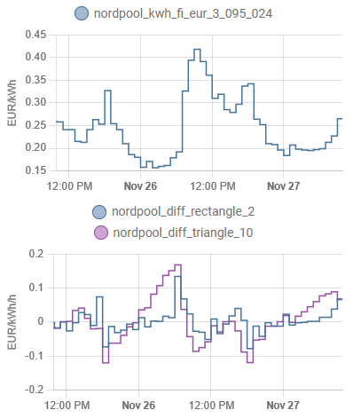

# nordpool_diff custom component for Home Assistant

Requires https://github.com/custom-components/nordpool

Applies non-causal FIR differentiator[^1] to [Nord Pool](https://www.nordpoolgroup.com/) spot prices, resulting in a
predictive sensor that gives positive output when the price of electricity for the current hour is cheaper compared to
the next few hours (and negative output in the opposite case).

The output can be used for e.g. adjusting target temperature of a heater so that it will heat more just before prices
will go up (to allow heating less when prices are high), and heat less just before prices will go down.

Apart from potentially saving some money, this kind of "temporal shifting of heating" can also save the environment,
because expensive peaks are produced by dirtier energy sources.

## Installation

1. Install and configure https://github.com/custom-components/nordpool first.
2. Copy the `nordpool_diff` folder to HA `<config_dir>/custom_components/nordpool_diff/`
3. Restart HA. (Skipping restarting before modifying configuration would give "Integration 'nordpool_diff' not found"
   error message from the configuration.)
4. Add the following to your `configuration.yaml` file:

    ```yaml
    sensor:
      - platform: nordpool_diff
        nordpool_entity: sensor.nordpool_kwh_fi_eur_3_095_024
    ```

   Modify the `nordpool_entity` value according to your exact entity value.

5. Restart HA again to load the configuration. Now you should see `nordpool_diff_triangle_10` sensor, where
   the `triangle_10` part corresponds to optional parameters, explained below.

## Optional parameters

Optional parameters to configure include `filter_length`, `filter_type` and `unit`, defaults are `10`, `triangle` and
`"EUR/kWh/h"`, respectively:

 ```yaml
 sensor:
   - platform: nordpool_diff
     nordpool_entity: sensor.nordpool_kwh_fi_eur_3_095_024
     filter_length: 10
     filter_type: triangle
     unit: EUR/kWh/h
 ```

`unit` can be any string. The default is EUR/kWh/h to reflect that the sensor output loosely speaking reflects change
rate (1/h) of hourly price (EUR/kWh).

`filter_length` value must be an integer between 2...20, and `filter_type` must be either `triangle` or `rectangle`.
They are best explained by examples. For illustrative purposes, the following FIRs have been reflected about the time
axis; the first multiplier corresponds to current hour and the next multipliers correspond to upcoming hours.

Smallest possible `filter_length: 2` creates FIR `[-1, 1]`. That is, price for the current hour is subtracted from the
price of the next hour, simplest possible differentiator. `filter_type` doesn't make a difference in this case.

`filter_length: 3`, `filter_type: rectangle` creates FIR `[-1, 1/2, 1/2]`.

`filter_length: 3`, `filter_type: triangle` creates FIR `[-1, 2/3, 1/3]`.

`filter_length: 4`, `filter_type: rectangle` creates FIR `[-1, 1/3, 1/3, 1/3]`.

`filter_length: 4`, `filter_type: triangle` creates FIR `[-1, 3/6, 2/6, 1/6]`.

`filter_length: 5`, `filter_type: rectangle` creates FIR `[-1, 1/4, 1/4, 1/4, 1/4]`.

`filter_length: 5`, `filter_type: triangle` creates FIR `[-1, 4/10, 3/10, 2/10, 1/10]`.

And so on. With rectangle, the right side of the filter is "flat". With triangle, the right side is weighting soon
upcoming hours more than the farther away "tail" hours. First entry is always -1 and the filter is normalized so that
its sum is zero. This way the characteristic output magnitude is independent of the settings.

You can set up several `nordpool_diff` entities, each with different parameters, plot them in Lovelace, and pick what
you like best. Here is an example:



## Attributes

Apart from the principal value, the sensor provides an attribute `"next_hour"`, which can be useful when we're close to
hour boundary and making decisions about turning something on; if it's xx:59 and the principal value is above some
threshold but the next hour value is below the threshold, and we would like to avoid short "on" cycles, then we maybe
shouldn't turn the thing on at xx:59 if we would turn it off only after 1 minute. This can be avoided by taking the next
hour value into account.

[^1]: Fancy way of saying that the price for the current hour is subtracted from the average price for the next few
hours.